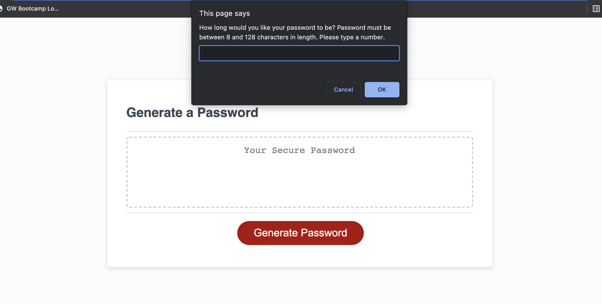
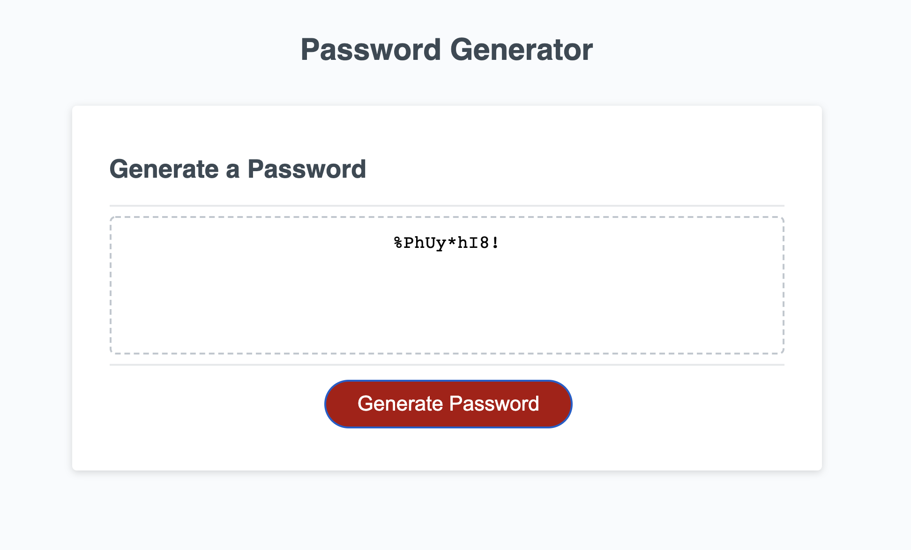

# Random Password Generator - Challenge 3

## Description
Created a website that randomly generates a password given specific character types (uppercase, lowercase,numbers, special characters) and length requirements (between 8-128 characters). 

## Built With
* HTML
* CSS
* JavaScript

## Website Link
https://rdenton3.github.io/password_generator/ 

## Photos

